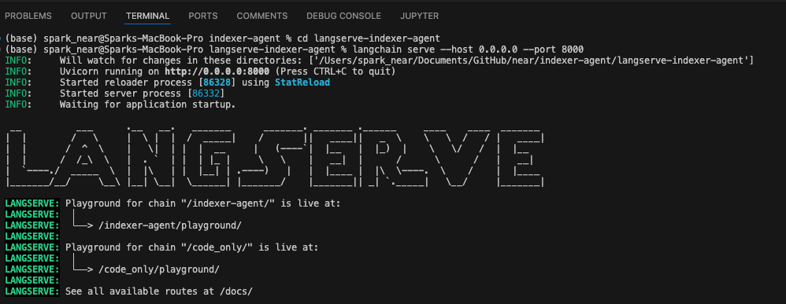
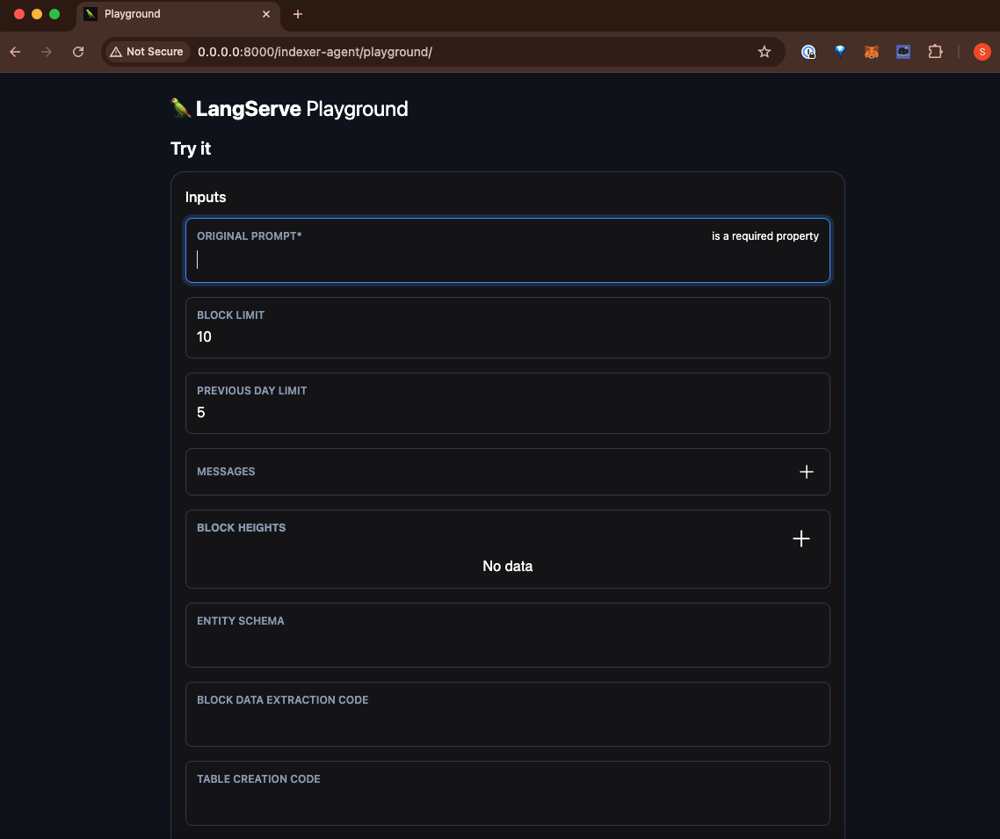

# Indexer Agent

## Description
### Problem:
Building blockchain indexers is challenging due to the complexity of requiring both expertise in NEAR’s data structure and designing efficient database schemas.
The NEAR Indexer AI Assistant is a powerful tool designed to simplify and automate the process of building blockchain indexers for decentralized applications on the NEAR Protocol. This project addresses the complexities associated with understanding the 

### Indexer Agent
Initial POC of Indexer Agent utilizing LangChain's [Langgraph](https://python.langchain.com/v0.1/docs/langgraph/), to automate the creation of indexers by filtering to specific contracts, inferring schemas from function calls, and generating working code to insert data into postgreSQL database.

## Setup
### Python
- `pip install -r requirements.txt`
- You will need to setup accounts with OpenAI and Langchain
- Create an .env file with the following: 
```env 
    OPENAI_API_KEY=<OPENAI_API_KEY>  
    OPENAI_ORGANIZATION=<OPENAI_ORGANIZATION>  
    LANGCHAIN_API_KEY=<LANGCHAIN_API_KEY>  
    LANGCHAIN_PROJECT=<LANGCHAIN_PROJECT>  
```

### PostgreSQL
- When setting up postgresql to run locally follow these steps
brew install postgresql
brew services start postgresql
psql postgres
CREATE ROLE username WITH LOGIN PASSWORD 'password';
CREATE DATABASE db OWNER username;
GRANT ALL PRIVILEGES ON DATABASE db TO username;

### Node Modules
- Run `npm install` in root directory to update node modules like @near-lake/primitives

## Structure
Below is a brief overview of the key files and directories within the Indexer Agent project:

- `IndexerAgent.ipynb`: The main Jupyter notebook that operates the Indexer Agent, including setup, configuration, and execution instructions.
- `agents/`: Contains the core logic for the indexer agents. Each agent is designed to perform specific tasks
- `graph/`: Contains graphs for how the agent nodes and edges work together
- `tools/`: Includes various utility scripts and tools are assigned to and used by agents.
- `query_api_docs/`: Contains documentation and examples for Query API used for RAG by the agent
- `SP/PK_ Notebooks`: Individual Jupyter notebooks that are used for development and testing. These are scratch work and may change over time.
- `requirements.txt`: Contains all the Python package dependencies required to run the Indexer Agent. Use `pip install -r requirements.txt` to install these dependencies.
- `.env`: A template file (not included in the repository for security reasons) that you should create to store your OpenAI and Langchain API keys and other configuration settings.

Please note that this structure is subject to change as the project evolves. Always refer to the latest version of the README for the most current information.

## Quickstart
- You can operating the current working version at [IndexerAgent](IndexerAgent.ipynb) 
- You can test out working code using [QueryAPI](https://dev.near.org/dataplatform.near/widget/QueryApi.App?view=create-new-indexer)
- You can follow progress of your calls using [Langsmith](https://smith.langchain.com/)
- You can setup a playground version by following README instructions under [Langserve](#langserve)

## Setting up PostgreSQL locally
Instructions to setup postgresql locally. You'll run the following commands (assuming macOS):

`brew install postgresql`  
`brew services start postgresql`  
`psql postgres`  
`CREATE USER username WITH PASSWORD 'password';`  
`CREATE DATABASE db;`  
`GRANT ALL PRIVILEGES ON DATABASE db TO username;`  
`\q`  

When running the script, if you run into an LRC Path issue, make sure to run within jupyter notebook:
%pip install psycopg2 psycopg2-binary
Sometimes you might also have to uninstall and reinstall psycopg2
`pip uninstall psycopg2`
`pip install psycopg2`
`pip install psycopg2-binary`

## Langserve
- To run Langserve, navigate to the langserve-indexer-agent folder `cd langserve-indexer-agent` 
- Make sure to run `pip install -U langchain-cli`
- Then run `langchain serve`, you can also explicitly run `langchain serve --host 0.0.0.0 --port 8000`
- Note that langchain serve does not currently allow for human in the loop ([issue](https://github.com/langchain-ai/langserve/issues/313)) so we run the create_graph_no_human_review() from master_graph.py script
- Navigate to http://localhost:8000/indexer-agent/playground/ and enter a prompt into the "Original prompt" field and click start



